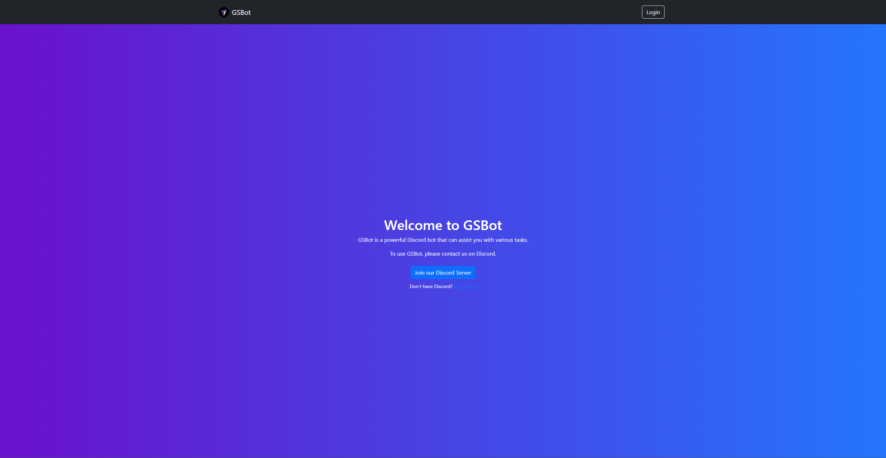
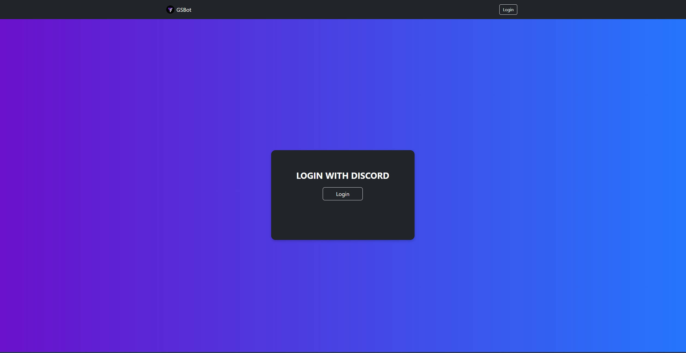
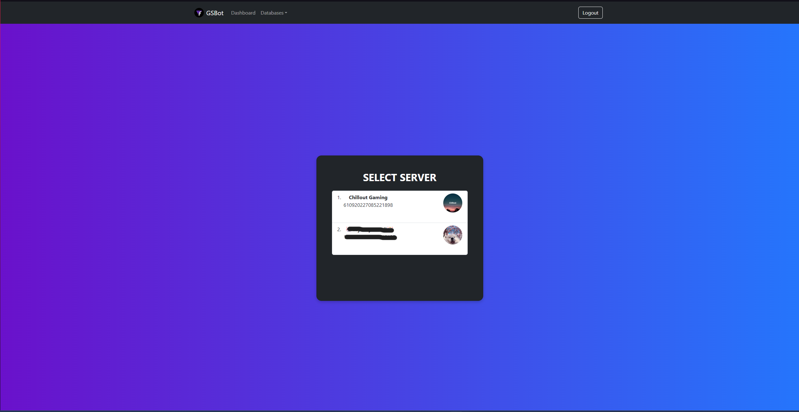
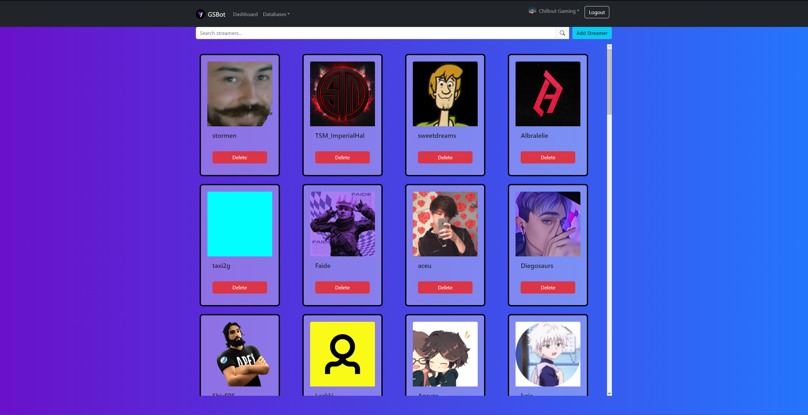
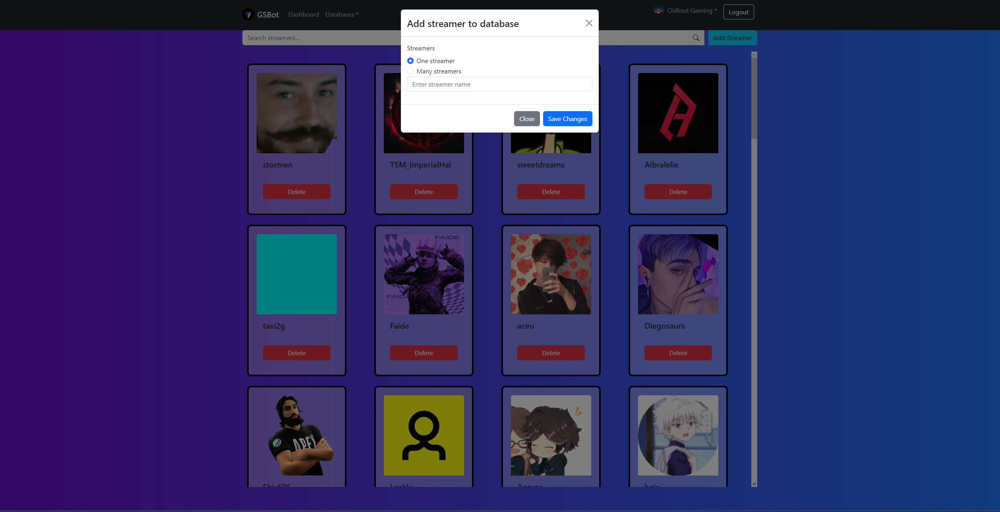
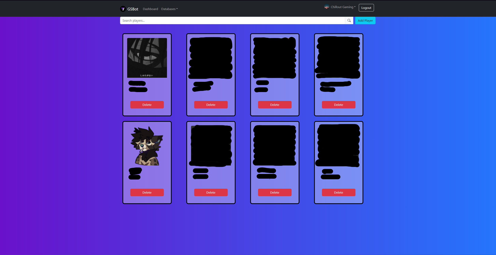
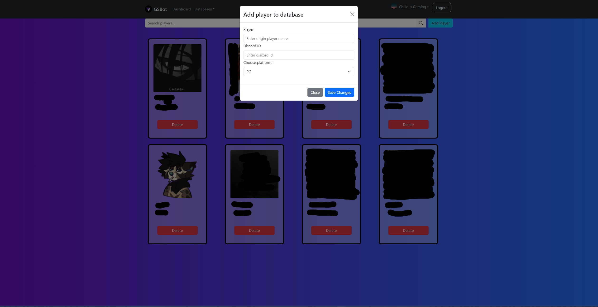

# Discord Bot 2.0 - Frontend 

This documentation provides an overview of the frontend of the Apex Legends Discord Bot project. The frontend is built using React and Bootstrap, allowing users to log in via Discord and manage the Apex players database and streamers database.

[Backend](https://github.com/shiro47/GSBot-2.0)

## Tech Stack

- React
- Bootstrap

## Getting Started

To run the frontend locally, follow these steps:

1. Clone the repository:

   ```bash
   git clone https://github.com/shiro47/GSBot-frontend.git
   ```
2. Navigate to the frontend directory:

  ```bash
cd GSBot-frontend
  ```
3. Install dependencies:

  ```bash
npm install
  ```

5. Start the development server:

```bash
npm start
  ```
This will start the development server, and you can view the application at http://localhost:3000 in your web browser.


## Features

### Discord Login
- Users can log in to the frontend using their Discord accounts.

### Apex Players Database Management
- View a list of registered Apex Legends players.
- Add new players to the database with validation.
- Remove players from the database.
### Streamers Database Management
- View a list of registered Twitch streamers.
- Add new streamers to the database with validation.
- Remove streamers from the database.

### Authentication Flow
1. Users click the "Login with Discord" button.

2. They are redirected to the Discord OAuth2 authorization page.

3. After authorization, users are redirected back to the frontend with an access token.

4. The frontend uses this access token to make authenticated requests to the backend.

## Screenshots
- Home Page


- Login


- Servers list


- Streamers database


- Add streamer


- Players database


- Add player


## Notes 
- The live demo might have restricted features compared to running the bot locally with your own Discord application credentials.
